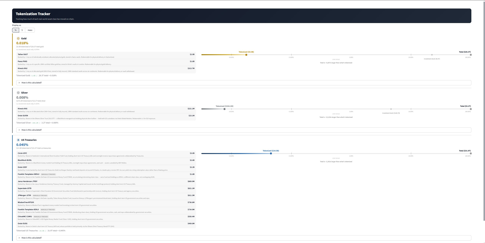

# Tokenization Tracker

A live dashboard measuring how much of gold, silver, and US Treasuries has
actually moved on-chain — and the methodology fights that went into getting
each number right (undercounts, double-counts, and the wrong turns along the
way are documented, not hidden). **[Live demo](#)** — replace with the
deployed URL.

How much of a real-world asset class has moved on-chain so far? This app tracks
tokenization's growth, one asset class at a time: a big headline stat (%, $, or —
where it makes sense — physical units), then two stacked bars comparing tokenized
value against the asset class's total real-world value. A linear bar is shown
first — usually rendering as basically empty, since the tokenized fraction is
often too small to see (tokenized gold is ~0.02% of all gold) — which is itself
the demonstration of why a second, log-scale bar follows it: a proper progress-bar
view (solid fill to "Tokenized," muted to "Total") with labeled ticks and a plain
"Total is ~6,000x larger..." callout, instead of leaving the scale gap to be
inferred from a dot's position.

Currently covers **gold** (PAXG + XAUT + KAU vs. total above-ground gold value),
**silver** (KAG + SLVON vs. total above-ground silver value), and **US Treasuries**
(BUIDL + USDY + USYC + JTRSY + USTB + OUSG + WTGXX + BENJI + iBENJI + JLTXX +
CUMIU vs. total US Treasury debt held by the public). Cards render in a
3-per-row grid (wide page layout) that keeps filling out as more asset classes
are added.

A fourth card, US private credit (Figure's tokenized HELOC portfolio vs. total
US private credit market), was built and then removed: the denominator measures
institutional business lending (direct lending, mezzanine, distressed debt),
while the numerator is a consumer home-equity product — a genuine category
mismatch, not just a labeling nitpick, even after fixing an earlier US-vs-global
error in the same card. Rather than ship a comparison that doesn't hold up, it's
pulled until there's either a properly category-matched denominator (e.g. total
US home equity/HELOC lending) or a different asset class entirely.



## Data sources & assumptions

### Gold

**Tokenized supply** — read live from Ethereum via `web3.py` for PAXG and XAUT:
- [PAXG](https://etherscan.io/token/0x45804880de22913dafe09f4980848ece6ecbaf78) (Paxos
  Gold), contract `0x45804880De22913dAFE09f4980848ECE6EcbAf78`, 18 decimals
- [XAUT](https://etherscan.io/token/0x68749665ff8d2d112fa859aa293f07a622782f38) (Tether
  Gold), contract `0x68749665FF8D2d112Fa859AA293F07A622782F38`, 6 decimals

`totalSupply()` and `decimals()` are called directly on each contract via a free
public RPC (`https://ethereum.publicnode.com` by default).

- [KAU](https://www.coingecko.com/en/coins/kinesis-gold) (Kinesis Gold) is
  different: it's natively minted on Kinesis's own ledger (a Stellar fork), and
  an on-chain read of its Ethereum contract only captures a "wrapped" fraction
  of the real supply (~1.64M of ~2.39M tokens, verified 2026-07-26) — the same
  issue as Silver's KAG, so KAU uses CoinGecko's aggregate `total_supply`
  instead, like Silver and Treasuries do.

PAXG and XAUT are the two largest gold-backed tokens by a wide margin. KAU
(~$315M) is a clear, worthwhile third (~6% on top of PAXG+XAUT combined) — the
same "worth it if not tiny" bar Silver's SLVON was added under. Smaller
gold-backed tokens (e.g. Comtech Gold) are still excluded — so the tokenized
total here is a slight *undercount*, never an overcount. Summing all three
doesn't double-count: they're backed by separate, independently audited gold
reserves, not shared collateral. For PAXG/XAUT specifically, only each token's
canonical Ethereum mainnet contract is read — if either is bridged/wrapped onto
another chain, that's done by locking the mainnet tokens (which stay counted in
mainnet `totalSupply`) and minting a claim elsewhere, not additional gold, so
bridging doesn't introduce double-counting either.

**Token prices** — fetched from the [CoinGecko free API](https://www.coingecko.com/en/api):
`/simple/price` for PAXG/XAUT (ids `pax-gold`, `tether-gold`); `/coins/markets`
for KAU (id `kinesis-gold`, which also supplies its aggregate supply figure).

**Gold spot price** — derived from PAXG's CoinGecko market price, not a separate
metals-price API. PAXG is redeemable 1:1 for a troy ounce of LBMA-good-delivery gold,
so its market price is a reasonable live proxy for spot gold, and reuses the price
call already needed for tokenized value. The same 1:1 relationship also means the
raw token quantities double as the tokenized *weight* — the "mass" display mode
sums PAXG + XAUT quantities directly, no extra fetch needed.

**Total above-ground gold value** — `total_tonnes × troy_oz_per_tonne × spot_price`,
where `total_tonnes` is a static constant in `config.py`:

> World Gold Council, Goldhub "How Much Gold" dataset — above-ground stock, year-end
> 2024 estimate (216,265 tonnes). Retrieved 2026-07-25.
> https://www.gold.org/goldhub/data/how-much-gold

This figure changes slowly, so it's a periodically-updated constant rather than
something scraped live. Update it in `config.py` (with a fresh citation/date) as new
Goldhub estimates are published.

**"vs. investment stock only" (secondary figure)** — the primary total above
includes jewelry, central-bank reserves, and industrial stock, none of which
tokenized gold is realistically competing with. The app also shows a narrower
comparison using only bars, coins, and gold-backed ETFs:

> World Gold Council, Gold Demand Trends Full Year 2024 — bars, coins, and
> gold-backed ETFs (48,634 t, year-end 2024). Retrieved 2026-07-26.

This is the actual investable pool tokenized gold competes with, shown
alongside (not instead of) the primary above-ground-stock percentage.

### Silver

**Tokenized supply & price** — fetched live from CoinGecko's `/coins/markets`
endpoint (`total_supply × current_price`) for both tokens, not read on-chain
directly:
- [KAG](https://www.coingecko.com/en/coins/kinesis-silver) (Kinesis Silver) is
  natively minted on Kinesis's own ledger (a Stellar fork) — its Ethereum ERC-20
  contract (`0x56BA8B58B7d1f6D384a1c4dd553f39ebc8741B8e`) is only a secondary
  "wrapped" representation holding a small fraction of total supply (an on-chain
  read there gave ~35,000 tokens vs. CoinGecko's aggregate ~3.78M).
- [SLVON](https://www.coingecko.com/en/coins/ishares-silver-trust-ondo-tokenized-stock)
  (Ondo's tokenized iShares Silver Trust) is natively minted across 4 chains
  (Ethereum, BNB Chain, Solana, HyperEVM) — same underlying multi-chain issue.

Both have the same fix as Treasuries' BUIDL/USDY: use the aggregator instead of a
single-chain read.

Per [DefiLlama's asset rankings](https://defillama.com/rwa/asset-group/precious-metals)
(2026-07-26), KAG is the dominant tokenized silver product (~$194M), SLVON is a
clear second (~$23M, ~12% on top of KAG — worth including), and a third
(STRATO Silver, ~$3.5M, ~1.8% on top) isn't, at least not yet. No double-counting
between KAG and SLVON: direct allocated-silver redemption vs. ETF shares, backed
by separate silver holdings. This is still an undercount, never an overcount.

**Total above-ground silver value** — this denominator is far murkier than gold's.
The Silver Institute's "identifiable above-ground stocks" (investment bars/coins
only, ~79,000 tonnes) is about 20x smaller than broader estimates that include
jewelry, silverware, and industrial stock. To stay comparable with gold's WGC
figure (which *does* include jewelry and industrial holdings), this uses the
broader estimate:

> CPM Group, comprehensive above-ground silver estimate (~2018 data, ~1.7 million
> tonnes). Retrieved 2026-07-26.
> https://cpmgroup.com/how-much-silver-is-above-ground/

This citation choice matters a lot for the resulting percentage — a reader
comparing this app's silver number against one using the narrower Silver Institute
figure will see a ~20x difference for reasons that have nothing to do with data
quality.

**"vs. investment stock only" (secondary figure)** — rather than picking one of
the two silver totals and hiding the other, the app shows the narrower Silver
Institute investment-only figure (bars/coins, ~79,000 t) as a secondary
comparison alongside the primary CPM Group total — the same "investable pool"
framing used for gold's alternate denominator above.

### US Treasuries

**Tokenized value** — BUIDL (BlackRock USD Institutional Digital Liquidity Fund),
USDY (Ondo US Dollar Yield), and USYC (Circle/Hashnote US Yield Coin) are
natively minted independently on multiple chains (BUIDL on 8, USDY on 12, USYC
on 3 — Ethereum, Sui, Canton), each with its own separate supply — there's no
single canonical chain whose `totalSupply()` represents the global total.

This went through three iterations, not one — including a wrong turn that got
corrected:
1. **First implementation**: read `totalSupply()` from each token's Ethereum
   mainnet contract, same as gold's PAXG/XAUT. The CoinGecko cross-check caught
   that this undercounted BUIDL by ~13x and USDY by ~2x, since — unlike
   PAXG/XAUT, which are single-canonical-chain tokens — these two have no chain
   whose local supply represents the total.
2. **Second fix (later found to be wrong)**: switched to CoinGecko's
   `/coins/markets` `total_supply × current_price`. Checking that against
   [DefiLlama](https://defillama.com/rwa)'s per-chain TVL breakdown showed a
   ~30% (BUIDL) / ~19% (USDY) gap, which looked like CoinGecko was *also*
   undercounting — so DefiLlama's larger number was made primary.
3. **Third fix (the correction)**: comparing against a third source,
   [rwa.xyz](https://rwa.xyz) (checked manually — no free API), showed rwa.xyz
   and CoinGecko agreeing closely (BUIDL: $2.61B vs. $2.64B; USDY: $2.16B vs.
   $2.15B), while DefiLlama was the outlier. The reason: BUIDL moves across its
   8 chains via Wormhole's **lock-and-mint** bridge — value gets locked on the
   source chain *and* a wrapped copy is minted on the destination chain, and
   both get counted when DefiLlama sums per-chain balances. CoinGecko's
   `total_supply` (and rwa.xyz's net-issuance tracking) don't have this
   problem. CoinGecko is back to being primary; DefiLlama is shown for
   comparison only, not trusted as ground truth.

The lesson: comparing two sources and trusting the larger number isn't
verification — it just picks a direction. A third source was needed to actually
resolve which one was right. (Gold's PAXG/XAUT don't have this problem — on-chain
reads, CoinGecko, and DefiLlama all agree within 0.5%, confirming they really are
single-canonical-chain tokens with no bridging ambiguity.)

BUIDL, USDY, USYC, and — added 2026-07-27 after a coverage review against
rwa.xyz's full ranked list — Janus Henderson's JTRSY (issued via Centrifuge),
Superstate's USTB (distributed with Invesco), Ondo's OUSG, and WisdomTree's
WTGXX are all fetched **live** every refresh, the same CoinGecko-primary
approach as BUIDL/USDY (as of 2026-07-26, USYC ~$3.0B AUM per CoinGecko and
DefiLlama agreeing closely; the four newer ones ~$400M-$870M each, all
corroborated within ~15% by rwa.xyz).

Four more — Franklin Templeton's **BENJI** and **iBENJI**, JPMorgan's
**JLTXX**, and ChinaAMC's **CUMIU** — are included as **manually maintained**
figures instead: none has a trustworthy live API (CoinGecko undercounts BENJI
by ~10x and doesn't list the other three at all; JLTXX runs on JPMorgan's
permissioned Kinexys ledger, not a publicly queryable chain). Each is set from
rwa.xyz and always reported as fallback/stale quality — the same honesty the
app already applies to any fallback figure, just permanent here rather than
outage-triggered, and refreshed periodically by hand instead of every request.

That review also corrected an earlier, blog-sourced estimate of the gap that
had turned out to be wrong in several places — see "Roadmap / known gaps"
below for the full trail and what's still missing. This remains an
undercount, never an overcount. No double-counting: all eleven are
independently managed funds/vehicles holding their own short-term Treasury
bills and repo positions, not wrapped/derivative versions of each other (BENJI
and iBENJI are different share classes of the same underlying fund, FOBXX,
which is not double-counting any more than a mutual fund's Class A vs. Class C
shares would be).

**Total Treasury debt** — fetched **live** on every refresh from the US Treasury's
own [Fiscal Data API](https://fiscaldata.treasury.gov/datasets/debt-to-the-penny/)
(`debt_to_penny`), using "Debt Held by the Public" (total public debt minus
intragovernmental holdings) as the closest live, daily-updated proxy for total
marketable Treasury debt. Unlike gold's above-ground stock, this changes daily, so
it's not a static config constant — only a fallback value is stored in `config.py`,
used solely if the live API call fails.

## Verification / cross-checking

Three tiers, depending on what's available for a given token:

1. **Independent second source** (Gold's PAXG/XAUT) — on-chain `totalSupply()`
   is cross-checked against both CoinGecko's `total_supply` and
   [DefiLlama](https://defillama.com/rwa)'s tracked TVL for the same protocol —
   free, no-key APIs, verified manually to track the right entity under a
   comparable metric before being wired in. All three agree within 0.5%.
2. **Two sources, arbitrated by a third** (Treasuries' BUIDL/USDY) — CoinGecko
   and DefiLlama disagreed by ~19-30%. Rather than assume the larger number was
   more complete (a mistake made once already — see above), a third source
   (rwa.xyz, checked manually) settled it: CoinGecko was right, DefiLlama was
   double-counting bridged supply. DefiLlama is still shown in the notes for
   transparency, just not trusted as the tiebreaker anymore.
3. **Same-source consistency check** (Gold's KAU, Silver) — `total_supply ×
   price` is checked against CoinGecko's own reported `market_cap` from the
   same API response. This can catch an internally inconsistent response
   (e.g. a stale field) but not a wrong source, since there's no free second
   provider tracking these specific tokens under a comparable metric
   (DefiLlama's "Kinesis Labs" listing is an unrelated protocol, not Kinesis
   Money's KAU/KAG; SLVON has no DefiLlama match either). rwa.xyz itself
   doesn't help here either — Kinesis data is locked behind their paid tier.

Results are shown under each asset's "How is this calculated?" expander as "Latest
verification". This is what caught the Treasuries multi-chain undercount, then
caught the *next* mistake made while fixing it, then a *third* pass (rwa.xyz)
caught that too — it's not just theoretical
insurance, it changed the implementation three times across two asset classes.

## Fallback / staleness handling

On-chain supply reads, CoinGecko price/cross-check fetches, and (for Treasuries) the
Treasury Fiscal Data API call can all fail (RPC down, API rate-limited). Each has a
manually-configured fallback value in `config.py`, seeded with a recently-observed
value and a comment noting when it was last refreshed — refresh these occasionally so
they don't drift too far from reality.

Every computed value carries a `DataQuality.LIVE` or `DataQuality.FALLBACK` tag.
`AssetClassResult.is_stale()` is true if *any* underlying value fell back, and the
Streamlit UI shows a "stale (fallback data in use)" badge in that case — so the app
degrades gracefully instead of crashing, and it's always visible when a number isn't
live.

## Running locally

```bash
python -m venv .venv
./.venv/Scripts/activate        # Windows; use `source .venv/bin/activate` on macOS/Linux
pip install -r requirements.txt
copy .env.example .env          # optional — defaults work out of the box
streamlit run app.py
```

Live data refreshes automatically at most once every 24 hours
(`st.cache_data(ttl=86400)` in `app.py`) — no manual refresh button. None of this
data moves fast enough to need refreshing more often, and CoinGecko's free,
no-key tier has a tight rate limit that a shorter interval was enough to trip.

Every token across every asset class shares **one** batched CoinGecko
`/coins/markets` call (`registry.all_tokens()` + `app.py`'s `_load_market_data`),
instead of each source fetching its own tokens independently — 8 tokens used to
mean up to 6 separate CoinGecko requests per refresh, occasionally enough to
trigger 429s and show fallback data across every card at once. An optional free
CoinGecko [Demo API key](https://www.coingecko.com/en/api/pricing) (`RC_COINGECKO_API_KEY`
in `.env`) raises the rate limit further if needed, but isn't required.

Each live fetch stores a new snapshot in SQLite (`data/reality_check.db`);
history is preserved across runs, enabling future charting of % tokenized over
time.

The Streamlit "Deploy" toolbar button is hidden by default (`.streamlit/config.toml`,
`toolbarMode = "minimal"`) since this app isn't meant to be one-click-deployed from a
local dev session — it doesn't affect the ability to actually deploy the app (e.g. via
Streamlit Community Cloud connected to this GitHub repo) when you're ready to.

## Running tests

```bash
pytest tests/
```

Tests cover the pure calculation logic (`reality_check/calc.py`) only — no network,
RPC, or database dependency.

## Architecture / adding a new asset class

```
reality_check/
├── models.py         # AssetClassResult, ComponentValue, TotalValue, DataQuality
├── calc.py            # pure pct_tokenized math — the only unit-tested surface
├── interfaces.py      # AssetClassSource contract
├── registry.py        # asset_class slug -> AssetClassSource instance
├── orchestrator.py     # source -> calc -> storage glue
├── storage.py         # SQLite schema + repository functions
├── viz.py             # Streamlit card/hero-stat/log-scale-bar rendering
└── sources/
    ├── onchain.py         # shared web3 ERC-20 supply reader
    ├── prices.py          # shared CoinGecko price fetcher + cross-check/consistency helpers
    ├── defillama.py       # shared free/no-key DefiLlama TVL fetcher + cross-check helper
    ├── gold.py            # GoldSource — on-chain-read reference implementation
    ├── silver.py          # SilverSource — CoinGecko-aggregate reference implementation
    └── treasuries.py      # TreasurySource — live-total-fetch + DefiLlama/CoinGecko implementation
```

To add a new asset class (e.g. tokenized real estate):

1. Add a new module in `reality_check/sources/`, implementing the `AssetClassSource`
   Protocol (`asset_class`, `fetch_tokenized()`, `fetch_total()`,
   `describe_methodology()`, `describe_quantity()`) — see `gold.py` (static total) or
   `treasuries.py` (live-fetched total) for reference patterns.
2. Add its config (contract addresses / API endpoints / fallback values / static
   totals with citations) to `config.py`.
3. Register it in `reality_check/registry.py`.
4. Add a visual theme entry (accent color, icon, log-bar gradient) to `_ASSET_THEME`
   in `reality_check/viz.py` — asset classes without one fall back to a neutral gray
   theme automatically, so this step is optional but recommended.

No changes needed to `calc.py` or `storage.py` — they only depend on the
`AssetClassResult`/`ComponentValue`/`TotalValue` models, not on how a source produces
them.

## Roadmap / known gaps

- **US private credit** — removed earlier for a category mismatch (HELOC vs.
  institutional business lending denominator); revisit with a properly matched
  denominator (e.g. total US home equity/HELOC lending) or drop it for a different
  private-credit product.
- **More Treasury products** — current total is ~$14.5B (BUIDL + USDY + USYC +
  JTRSY + USTB + OUSG + WTGXX + BENJI + iBENJI + JLTXX + CUMIU), up from ~$7.8B
  a few passes ago. **Janus Henderson JTRSY** (~$870M, issued via Centrifuge),
  **Superstate USTB** (~$820M, distributed with Invesco), **Ondo OUSG**
  (~$409M), and **WisdomTree WTGXX** (~$737M) were wired in 2026-07-27 via
  their CoinGecko listings, same multi-chain-aggregate approach as
  BUIDL/USDY/USYC.
  - That pass also **corrected an earlier gap estimate that turned out to be
    wrong** — it had been built from blog aggregator sources instead of
    rwa.xyz directly, and named "Spiko ~$2.2B", "Kinexys ~$913M", "Centrifuge
    ~$891M", and "Libeara ~$786M" as top candidates. Checked directly against
    rwa.xyz's own ranked list: Spiko's actual fund (USTBL) is only ~$145M
    (well under the 5% bar), and Kinexys/Centrifuge/Libeara don't appear as
    named issuers in rwa.xyz's list at all — likely fabricated or conflated by
    the blog sources. "Centrifuge" turned out to really be JTRSY (Centrifuge
    is the issuing protocol, Janus Henderson/Anemoy the manager).
  - **A follow-up pass tied out the remaining gaps that have no live API at
    all**, as manually maintained figures (`TokenConfig.manual_value_usd`,
    always reported as fallback/stale quality — same honest treatment as any
    other fallback, just permanent instead of outage-triggered, refreshed
    periodically from rwa.xyz): **Franklin Templeton BENJI** (~$735M) +
    **iBENJI** (~$1.76B, the accumulating share class of the same fund,
    FOBXX), **JPMorgan JLTXX** ("Kinexys", ~$811M), and **ChinaAMC CUMIU**
    (~$550M). None have a trustworthy live source: CoinGecko's
    `franklin-templeton-benji` listing undercounts BENJI by ~10x
    (`total_supply` implies ~$226M vs. its real ~$735M, and there's no
    separate iBENJI listing at all) — confirmed by also reading BENJI's
    Stellar issuer directly via the Horizon API (~$489M), which shows even
    Stellar, the fund's original chain, no longer holds the full multi-chain
    total either. JLTXX and CUMIU have no price/supply/contract data on
    CoinGecko or DefiLlama at all (JLTXX runs on Kinexys, JPMorgan's
    permissioned ledger — not a publicly queryable chain).
  - **Residual gap, accepted rather than chased**: ~$1.7B still spread across
    dozens of smaller funds (largest is OpenEden at ~$256M, ~1.8% of the
    current total) — not individually worth the same per-token verification
    effort as the ones above.
- **% tokenized over time** — snapshots are already stored in SQLite on every
  live refresh (see "Running locally" above); nothing charts that history yet.
